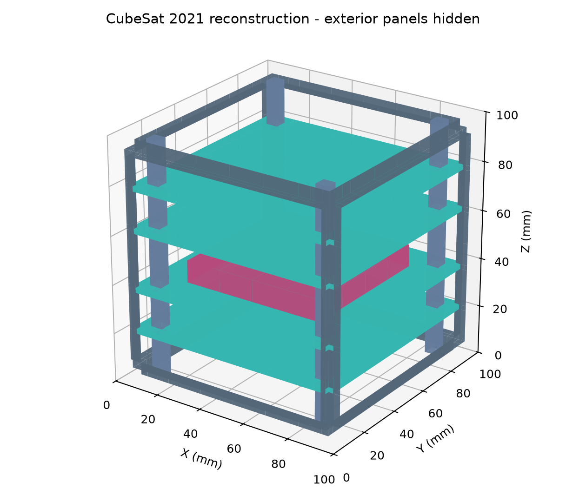
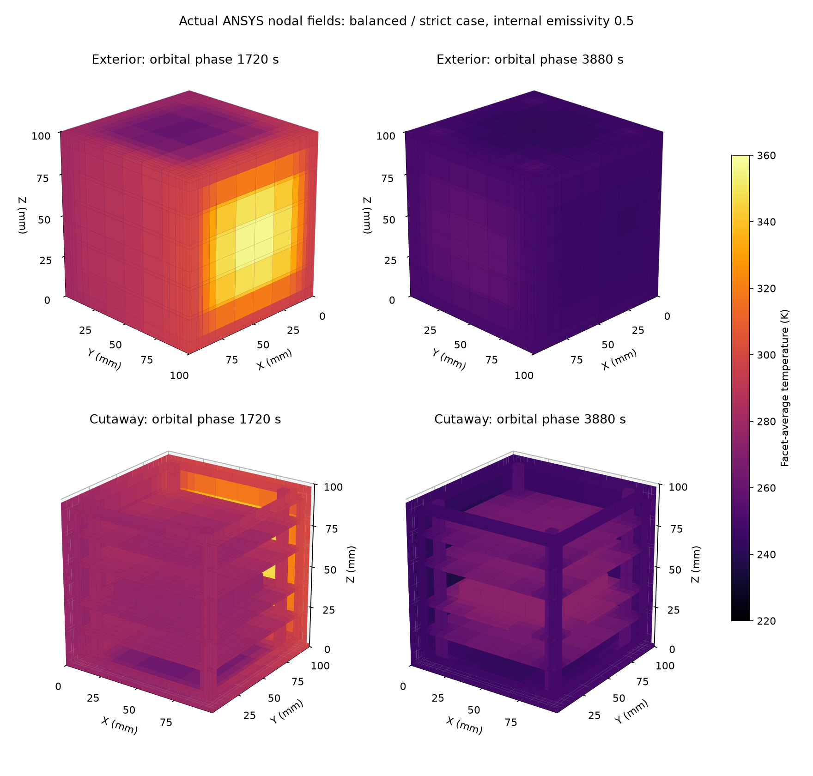
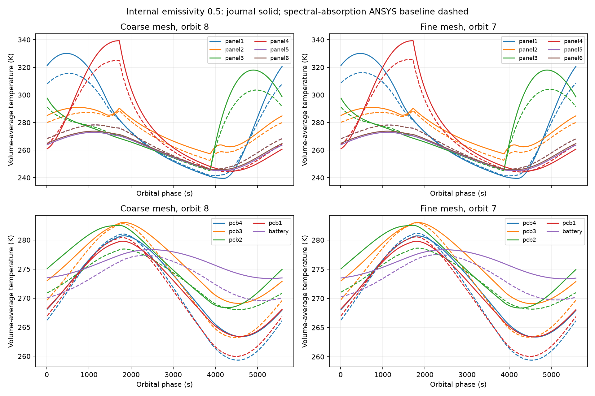
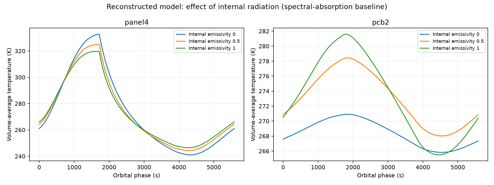

# CubeSat thermal benchmark: conduction and radiation

A reproducible reconstruction of a published 1U CubeSat thermal problem using **SolidWorks and ANSYS MAPDL**. The solid model contains six exterior panels, an aluminum frame and supports, four PCBs, and a battery. A transient low Earth orbit calculation combines conduction, solar and albedo heating, Earth infrared, and diffuse-gray internal and external radiation. No convection or fluid domain is included.

**Status:** verified numerical model with a documented paper-comparison discrepancy. It reproduces the orbital trends and the effect of internal radiation. The spectral-absorption baseline has approximately **2–7 K volume-average temperature RMSE** against the paper, with maximum differences around **15 K**. This project does not claim exact replication, experimental validation, or flight qualification.

[Latest numerical qualification and uncertainty results](results/Qualification_Overview.md) · [Full study report](results/Numerical_Uncertainty_Report.md)



## Read the project

- [Technical report](results/Numerical_Uncertainty_Report.md): numerical qualification and assumed-input uncertainty.
- [Results overview](results/Qualification_Overview.md) and [interface study](results/Interface_Limits_Report.md).
- [Reproduction instructions](docs/reproduction.md): dependencies, commands and evidence.
- [Methods and assumptions](docs/methodology.md).
- [Portfolio summary](docs/portfolio_summary.md) and [milestone status](docs/milestone_status.md).

## What is implemented

- Reconstruction of a dimensioned, 27-body CAD assembly, with neutral exports and overlap checks.
- A conformal solid mesh with explicitly measured conductive interfaces and obstructed internal radiation.
- Periodic transient thermal analysis for internal emissivities 0, 0.5 and 1.
- Solid-mesh, solver time-step and radiation-resolution qualification, plus six-factor assumed-input screening and nonlinear joint checks.
- Energy-balance auditing, orbital periodicity checks, numerical sensitivity, and comparison with directly extracted journal curves.
- Investigation of an ambiguity in the paper's incident-heat equations without fitting material properties or shifting the time axis.

## Evidence

The original verification and sensitivity cases below are retained for traceability. The [completed numerical and uncertainty study](results/Numerical_Uncertainty_Report.md) adds matched-period spatial, temporal and view-factor resolution checks.

| Check | Result | Meaning |
|---|---:|---|
| Analytical radiative cooling, 1 s step | Maximum error 0.00094 K over 1,000 s | External radiation/transient implementation check |
| Isolated gray enclosure, 500 s | Energy drift below 0.00012 J; mean drift below 0.000001 K | Internal radiation conservation with closure/reciprocity and tight heat convergence |
| Coarse epsilon 0.5 periodicity, orbit 8 | Maximum nodal cycle change 0.049 K | Settled baseline orbit |
| Finer in-plane mesh | Maximum main-part average change 0.815 K | Sensitivity check; includes remaining fine-mesh drift |
| Time step 10 s to 5 s | Maximum main-part average change 0.398 K | Time-resolution sensitivity |
| Radiation divisions 20 to 40 | Maximum main-part average change 0.020 K | Radiation-resolution sensitivity |
| Final-orbit global energy audit, epsilon 0.5 | RMS residual approximately 0.055 W / 0.33% of heat throughput | Postprocessed conservation diagnostic |
| Initial balanced/strict epsilon 0.5 case | Energy RMS approximately 0.000001 W; nodal cycle change 0.309 K | Stronger conservation settings; same physical model |
| Direct journal temperature comparison | Approximately 2–7 K RMSE | Remaining model/source mismatch |

The energy audit uses an approximate surface-temperature integration. A two-mesh sensitivity check does not establish asymptotic or through-thickness convergence. The epsilon 0 and 1 cases were checked for periodicity but were not independently given the same numerical sensitivity study.

The input generator now enforces closure/reciprocity for the closed internal radiation enclosure and uses a relative nonlinear heat tolerance of 1e-8. The recorded original sensitivity and emissivity studies used default heat convergence. The additional `balanced_strict` case changes part-average temperatures by at most 0.328 K and has pooled journal RMSE 4.28 K. See the [conservation improvement report](results/Conservation_Improvement_Report.md). Historical and improved outputs are labeled separately.



These are actual final-orbit nodal temperatures from the original balanced/strict case, displayed as facet averages near eclipse entry and exit. The cutaway hides three panels for viewing; the solved geometry is unchanged. `final_orbit_fields.npz` allows the figure to be regenerated without the large nodal history.





See [direct comparison](results/Journal_Validation_Report.md), [methodology and assumptions](docs/methodology.md), and [reproduction instructions](docs/reproduction.md). The [heat-input interpretation study](results/Load_Interpretation_Report.md) shows that applying unweighted incident heat worsens pooled RMSE from 4.31 K to 17.90 K; that separately labeled test is retained instead of being substituted for the physical baseline.

## Run without ANSYS

Python 3.10 or newer is sufficient to check inputs and reproduce the figures from the compact output tables:

```sh
python -m pip install -r requirements.txt
python check_inputs.py
python render_results.py
python check_release.py
```

This regenerates figures and temperature-comparison metrics. It does not rerun the thermal solver.

## Run the solver

A licensed MAPDL installation is required. SolidWorks is optional unless rebuilding the native CAD: the solver mesh is generated directly by Python from the same geometric partition.

```sh
python run_benchmark.py --ansys "PATH_TO_MAPDL_EXECUTABLE" --epsilon 0.5 --h 15 --duration 44640 --warm-orbits 6
```

The example solves eight orbits, with six coarse warm-up orbits and two at a maximum 10 s step. Review the generated `solution_audit.json`; elapsed cycles alone do not establish periodicity. Existing result folders are protected from overwriting. The historical outputs included here used the staged continuation histories documented in [reproduction](docs/reproduction.md).

## Contents

| Folder | Contents |
|---|---|
| `data/cad/` | Native CAD, STEP/Parasolid, verification records and preview |
| `data/ansys/` | Captured solver inputs, meshes and initial-state evidence |
| `config/` | Materials, declared orbit, reference-curve samples and source hashes |
| `results/` | Compact final-orbit tables, numerical audits and figures |
| `docs/` | Physical assumptions, validation limits and reproducibility details |
| Root scripts | CAD automation, input generation, solver runners, analysis and checks |

Scripts live at the repository root, matching the companion [cold-plate](https://github.com/rakesh12shankar/canopy-cold-plate-cht), [microchannel](https://github.com/rakesh12shankar/microchannel-heat-sink-benchmark) and [JT microsystem](https://github.com/rakesh12shankar/jt-microsystem-cooling) repositories.

Large ANSYS databases, restart files and nodal histories are excluded. Downloaded third-party papers and full-text transcriptions are also excluded. `SHA256SUMS.json` identifies the packaged input/results files.

## Reference

E. Morsch Filho, L. O. Seman and V. P. Nicolau, *Simulation of a CubeSat with internal heat transfer using Finite Volume Method*, Applied Thermal Engineering **193** (2021), 117039. [DOI](https://doi.org/10.1016/j.applthermaleng.2021.117039).

The [author's thesis](https://repositorio.ufsc.br/handle/123456789/227096) provides supplementary drawings and source context. The journal is the comparison target. Digitized curves are plotted reference estimates, not original author simulation data.

The MIT license covers the original project scripts, reconstructed CAD and numerical outputs. Third-party reference material retains its original rights; the code license does not relicense the paper or its source figures. ANSYS and SolidWorks are separately licensed commercial software.

## Interface sensitivity study

A matched bonded control and three zero-direct-conductance diagnostics isolate panel seams, frame-to-PCB contacts, and their combined effect. These are limiting hypotheses with unchanged geometry and radiation, not recovered author contacts. See the [interface study](results/Interface_Limits_Report.md), including periodicity and component-specific errors.

```sh
python check_interface_inputs.py
python report_interface_limits.py
```

Captured inputs and mapped initial temperatures allow each case to be rerun with `run_saved_case.py`; for example:

```sh
python run_saved_case.py data/ansys/captured_interface_seams_off --ansys "PATH_TO_MAPDL_EXECUTABLE"
```

## Numerical qualification and input uncertainty

The [completed numerical and uncertainty study](results/Numerical_Uncertainty_Report.md) reports multiple spatial levels, three time steps and three hemicube resolutions, matching-phase periodicity, battery extrema, PCB spreads, and paired input scenarios. Read its resolution qualifications before using local temperatures. Uncertainty intervals are analyst assumptions; conditional affine bands are not measured confidence intervals.

Regenerate the summaries without ANSYS:

```sh
python report_qualification.py --cases results/cases --out results --selection config/qualification_case_selection.json
```

Rerun any captured case with a licensed MAPDL installation using `run_saved_case.py`. Its initial state, forcing, mesh, and physical properties are included; large solver files and third-party PDFs are excluded.
