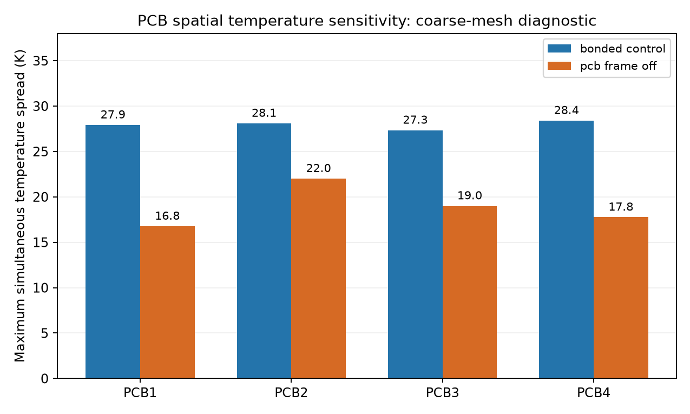
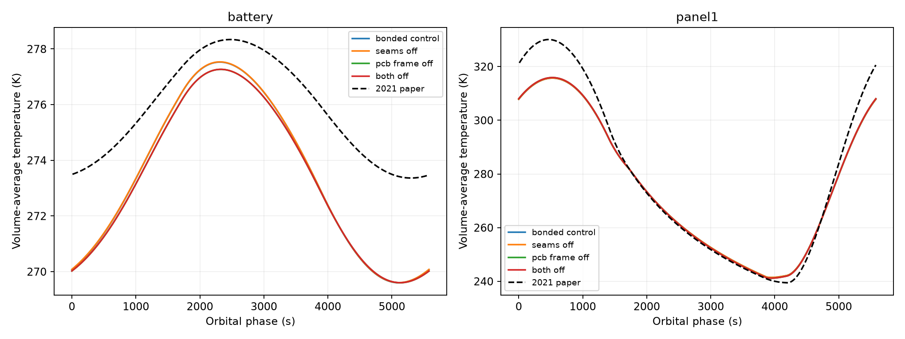

# Direct-interface limiting-case study

Direct-interface zero-conductance limits; unchanged geometry and radiation

Each initial diagnostic starts from the same mapped phase-zero temperature field and solves two complete 10 s orbits with closure/reciprocity and strict heat convergence. Unsettled variants are extended using six 60 s warm-up orbits followed by two 10 s orbits, then two additional 10 s orbits to reduce the remaining drift. Only the final resolved orbit is compared. Material properties, volumes, radiating faces and absorbed loads are fixed. No properties or time shifts are fitted.

| Case | Journal RMSE (K) | Maximum curve error (K) | Cycle change (K) | Battery min/max (K) | Max change from control (K) |
|---|---:|---:|---:|---:|---:|
| bonded_control | 4.281 | 15.074 | 0.0069 | 269.60 / 277.53 | 0.000 |
| seams_off | 4.278 | 15.078 | 0.0106 | 269.61 / 277.54 | 0.015 |
| pcb_frame_off | 4.275 | 15.031 | 0.0105 | 269.60 / 277.27 | 0.584 |
| both_off | 4.273 | 15.036 | 0.0105 | 269.60 / 277.27 | 0.583 |

| Case | Coldest battery node (K) | Hottest battery node (K) | Maximum simultaneous battery spread (K) |
|---|---:|---:|---:|
| bonded_control | 269.190 | 277.773 | 0.863 |
| seams_off | 269.195 | 277.780 | 0.863 |
| pcb_frame_off | 269.199 | 277.501 | 0.831 |
| both_off | 269.200 | 277.502 | 0.831 |

Maximum simultaneous nodal temperature spread on each PCB:

| PCB | Bonded control (K) | Seams off (K) | PCB/frame off (K) | Both off (K) |
|---|---:|---:|---:|---:|
| pcb1 | 27.913 | 27.908 | 16.762 | 16.760 |
| pcb2 | 28.094 | 28.088 | 22.007 | 22.006 |
| pcb3 | 27.333 | 27.328 | 19.003 | 19.003 |
| pcb4 | 28.395 | 28.391 | 17.757 | 17.755 |

Removing frame-to-PCB contact changes main-component volume-average temperatures by at most 0.584 K, while changing a PCB's maximum simultaneous nodal spread by as much as 11.151 K. This demonstrates why volume-average agreement alone does not establish local-temperature accuracy. The spatial result requires mesh qualification.

The smallest pooled RMSE among these cases is 4.273 K (both_off), compared with 4.281 K for the bonded control.

All four final comparisons meet the prespecified 0.1 K maximum nodal cycle-change target. Global final-orbit RMS power residuals are below 9.52e-07 W.

The pooled RMSE weights the eleven component curves equally. Battery values are volume averages, not hottest battery-node temperatures.

0.1 K nodal periodicity is a study target, not an externally mandated tolerance. Cases above it remain transient screening results.

No finite contact-conductance calibration or experimental validation. Coincident sealed interfaces, unchanged radiation surfaces, and alternate paths through frame at junctions remain. This cannot recover author CAD or isolate view-factor algorithm differences. Nodal extremes and spatial spreads are coarse-mesh diagnostics; formal spatial and through-thickness convergence remains necessary.

Panel seam removal deletes only direct panel-to-panel links. Frame-mediated continuity at geometric junctions is retained. PCB/frame removal leaves the bolt paths and battery/PCB contact intact.

Source rationale: the paper describes the supports as conductive paths to the PCBs and battery attachment to PCB2; it does not fully specify the reconstructed PCB/frame interface locations. Its lumped model explicitly omits direct panel-to-panel conduction, but that does not establish the same assumption for the finite-volume model. These limits therefore test reconstruction ambiguity rather than assert a source correction.

Interpret these runs as hypothesis tests and bounding diagnostics. A smaller paper error does not prove a more accurate physical contact arrangement. Formal mesh/time convergence and source-supported finite contact ranges remain separate studies.
