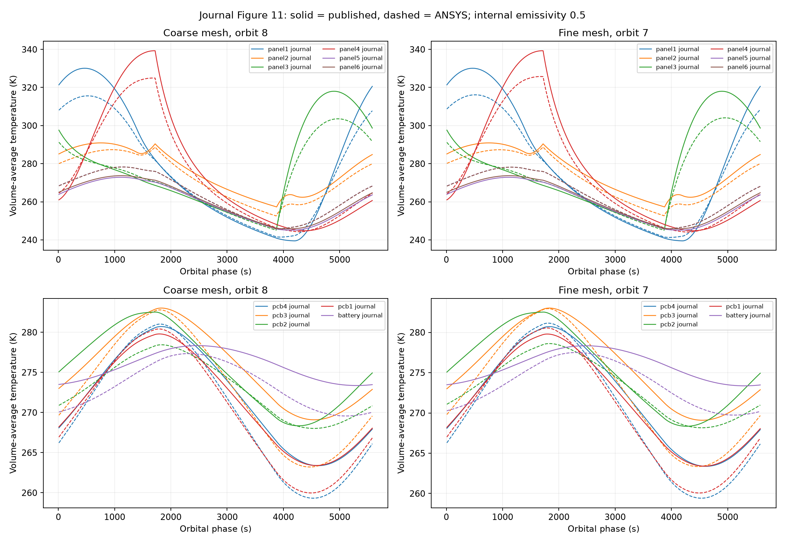
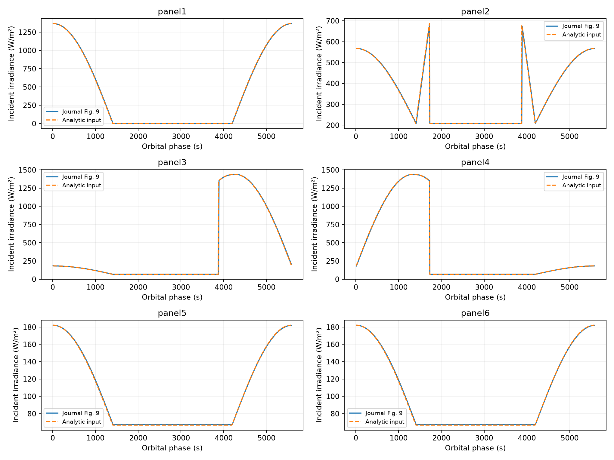

# Direct validation against the 2021 journal paper

The downloaded journal PDF is verified as Morsch Filho, Seman and Nicolau, Applied Thermal Engineering 193 (2021), 117039. Figures 9 and 11 were extracted directly from vector paths on PDF pages 7 and 9. No phase shift, material adjustment, or curve fitting was applied. Figure 11 uses internal emissivity 0.5 and volume-average temperatures.

## Temperature comparison

| Part | Coarse orbit 8 RMSE (K) | Fine orbit 7 RMSE (K) | Coarse maximum error (K) |
|---|---:|---:|---:|
| panel1 | 6.93 | 6.65 | 14.80 |
| panel2 | 3.78 | 3.73 | 5.37 |
| panel3 | 6.63 | 6.36 | 15.09 |
| panel4 | 5.82 | 5.51 | 14.36 |
| panel5 | 3.76 | 3.68 | 5.64 |
| panel6 | 2.97 | 2.90 | 4.64 |
| pcb4 | 2.45 | 2.37 | 4.26 |
| pcb3 | 3.64 | 3.53 | 5.99 |
| pcb2 | 3.19 | 3.07 | 5.31 |
| pcb1 | 2.02 | 1.95 | 3.65 |
| battery | 2.67 | 2.52 | 3.93 |

The journal and previously extracted thesis Figure 48 differ by at most 0.008 K after interpolation on their original axes. This supports using the thesis as supplementary evidence for this temperature case; it does not establish identical orbital ephemerides.

## Incident radiation comparison

| Face | Full RMSE (W/m²) | RMSE outside eclipse edges (W/m²) |
|---|---:|---:|
| panel1 | 5.59 | 5.66 |
| panel2 | 20.29 | 3.85 |
| panel3 | 54.46 | 4.17 |
| panel4 | 3.51 | 3.53 |
| panel5 | 0.72 | 0.72 |
| panel6 | 0.72 | 0.72 |

Figure 9 shows total incident irradiance, so this comparison sums solar, albedo and Earth infrared before applying surface absorptivity. The second metric excludes ±30 s around 1720 and 3880 s; the full metric retains those transitions. Sampling is 10 s and curve calibration is approximate.

## Assessment

The journal PDF removes the outstanding source-access limitation. The model reproduces the general orbital temperature behavior, but the temperature residuals remain too large to claim close quantitative validation. Previously measured numerical sensitivities are below 1 K (maximum part-average change: mesh 0.82 K, time step 0.40 K, radiation discretization 0.02 K). Geometry/contact assumptions and radiation visibility therefore remain priorities for investigation; their contribution has not yet been isolated.

The fine mesh has just under 1 K remaining nodal orbit-to-orbit change, while coarse orbit 8 has about 0.05 K. The mesh comparison includes this drift. Two in-plane meshes do not establish formal convergence. No validation tolerance was prescribed, and no parameters were tuned to the paper.

Extracted CSVs are in `config/journal_figure9_reference.csv` and `config/journal_figure11_reference.csv`; calibration, source hash and all metrics are in `journal_validation.json`.
