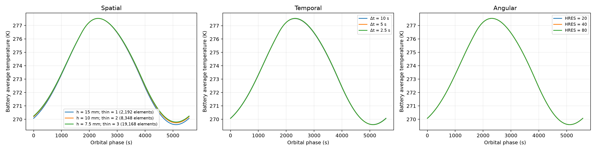
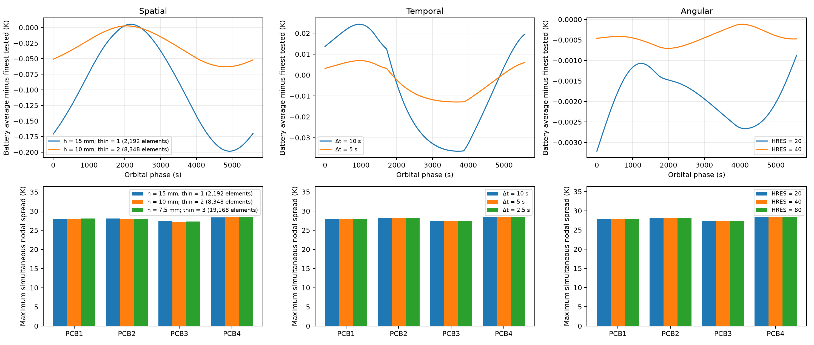
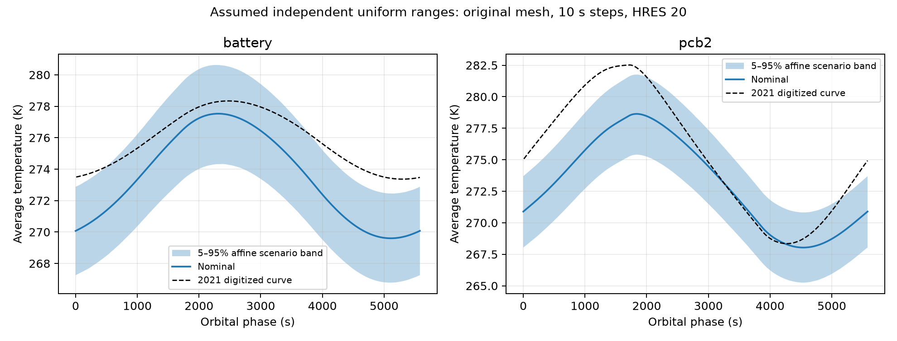
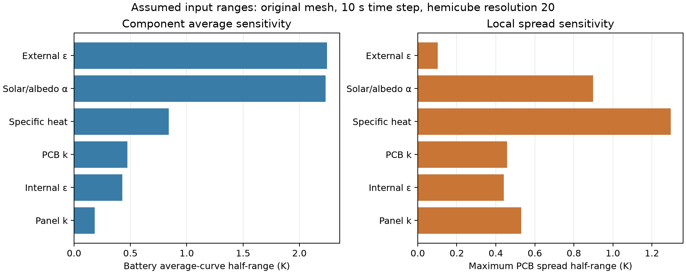
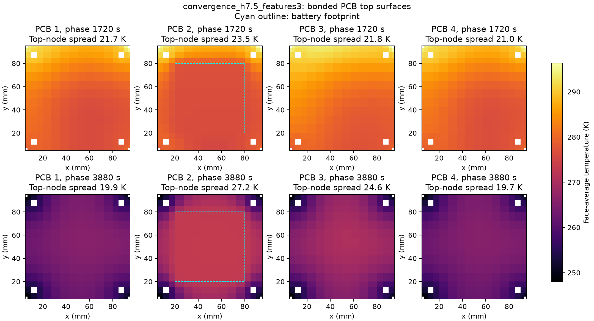

# Numerical qualification and input uncertainty

This study assesses numerical resolution and assumed-input sensitivity of the reconstructed conduction–radiation model. Source-paper curve comparison is numerical benchmarking, not experimental validation. Input intervals are declared engineering assumptions; their probability distributions were not measured.

## Spatial resolution

| Case | Elements | Periodicity (K) | Journal RMSE (K) |
|---|---:|---:|---:|
| convergence_h15_features1 | 2192 | 0.00687 | 4.2805 |
| convergence_h10_features2 | 8348 | 0.00833 | 4.1105 |
| convergence_h7.5_features3 | 19168 | 0.00586 | 4.0877 |

| Adjacent cases | Max average-curve change (K) | Max battery nodal-extreme change (K) | Max PCB spread change (K) |
|---|---:|---:|---:|
| convergence_h15_features1 → convergence_h10_features2 | 0.8899 | 0.1033 | 0.2378 |
| convergence_h10_features2 → convergence_h7.5_features3 | 0.0693 | 0.0348 | 0.1341 |

Final adjacent-pair screening targets: PASS. Targets: 0.25 K for average curves and battery nodal extrema; 0.5 K for PCB maximum spreads.

## Temporal resolution

| Case | Elements | Periodicity (K) | Journal RMSE (K) |
|---|---:|---:|---:|
| convergence_h15_features1 | 2192 | 0.00687 | 4.2805 |
| convergence_dt5_extend | 2192 | 0.00223 | 4.2758 |
| convergence_dt2.5 | 2192 | 0.05468 | 4.2732 |

| Adjacent cases | Max average-curve change (K) | Max battery nodal-extreme change (K) | Max PCB spread change (K) |
|---|---:|---:|---:|
| convergence_h15_features1 → convergence_dt5_extend | 0.4203 | 0.0102 | 0.0496 |
| convergence_dt5_extend → convergence_dt2.5 | 0.2116 | 0.0066 | 0.0241 |

Final adjacent-pair screening targets: PASS. Targets: 0.25 K for average curves and battery nodal extrema; 0.5 K for PCB maximum spreads.

## Angular resolution

| Case | Elements | Periodicity (K) | Journal RMSE (K) |
|---|---:|---:|---:|
| convergence_h15_features1 | 2192 | 0.00687 | 4.2805 |
| convergence_hemicube40 | 2192 | 0.00029 | 4.2797 |
| convergence_hemicube80 | 2192 | 0.00015 | 4.2796 |

| Adjacent cases | Max average-curve change (K) | Max battery nodal-extreme change (K) | Max PCB spread change (K) |
|---|---:|---:|---:|
| convergence_h15_features1 → convergence_hemicube40 | 0.0049 | 0.0014 | 0.0227 |
| convergence_hemicube40 → convergence_hemicube80 | 0.0016 | 0.0008 | 0.0054 |

Final adjacent-pair screening targets: PASS. Targets: 0.25 K for average curves and battery nodal extrema; 0.5 K for PCB maximum spreads.

The spatial sequence refines background spacing and thin-region divisions together. It is anisotropic; no uniform-ratio Richardson extrapolation or GCI is claimed. Reported differences are resolution diagnostics, not a bound on every local temperature.

Solver warning counts are retained in each packaged execution summary. MAPDL warns about radiation temperature offsets and the simultaneous presence of view-factor scaling and space-temperature commands. Temperatures here are absolute kelvin with zero offset. The input audit confirms that closure/reciprocity scaling applies only to the closed internal enclosure 1, while the 2.7 K space temperature applies only to the open exterior enclosure 2; the exterior is not forced closed.

Interface-gradient conclusions remain conditional on the original contact-study meshes. Matched refinement of the zero-direct-conductance variants is needed to establish contact-effect independence from numerical resolution.

The angular study changes the hemicube resolution on the same solid mesh and time step. ANSYS documents [HEMIOPT](https://ansyshelp.ansys.com/public/Views/Secured/corp/v242/en/ans_cmd/Hlp_C_HEMIOPT.html) as controlling view-factor accuracy. It tests radiation quadrature separately from solid refinement; closure and energy conservation alone cannot establish view-factor accuracy.

Time-step RMS differences also provide observed-order diagnostics for the 10→5→2.5 s sequence in the JSON report. These are indicators of approach to an asymptotic regime, not certified error bounds; residual periodicity and phase interpolation can affect small differences.

The temporal study holds the 10 s tabulated orbital forcing fixed and lets ANSYS interpolate it at smaller solver steps. It isolates time integration; it does not establish convergence of the forcing time sampling or finite-Earth-disk quadrature. Captured starting states use continuation, and each selected final orbit must independently pass the periodicity check.

## Finest bonded case: source-curve discrepancies

These comparisons use digitized component-average curves at their recorded orbital phases, without shifting the time axis or fitting properties. Numerical-resolution agreement does not remove geometry, forcing or source-model differences.

| Part | RMSE (K) | Maximum absolute difference (K) | Mean bias (K) |
|---|---:|---:|---:|
| panel1 | 6.551 | 14.003 | -3.461 |
| panel2 | 3.701 | 5.208 | -3.525 |
| panel3 | 6.290 | 14.245 | -3.278 |
| panel4 | 5.421 | 13.343 | -2.977 |
| panel5 | 3.611 | 5.542 | 3.144 |
| panel6 | 2.828 | 4.541 | 2.349 |
| pcb4 | 2.373 | 4.162 | -1.749 |
| pcb3 | 3.507 | 5.841 | -2.878 |
| pcb2 | 3.042 | 5.108 | -2.287 |
| pcb1 | 1.954 | 3.551 | -1.272 |
| battery | 2.490 | 3.704 | -2.264 |

## Finest bonded case: local temperatures

Extrema cover the final recorded orbit. Maximum nodal spread is the largest simultaneous within-part difference, rather than the difference between extrema at unrelated phases.

| Part | Average minimum (K) | Average maximum (K) | Nodal minimum (K) | Nodal maximum (K) | Maximum nodal spread (K) |
|---|---:|---:|---:|---:|---:|
| battery | 269.797 | 277.525 | 269.292 | 277.821 | 1.002 |
| pcb1 | 260.062 | 280.612 | 244.902 | 300.251 | 28.080 |
| pcb2 | 268.180 | 278.662 | 244.594 | 301.476 | 27.849 |
| pcb3 | 263.361 | 283.044 | 244.588 | 301.479 | 27.320 |
| pcb4 | 259.417 | 281.220 | 244.890 | 300.256 | 28.492 |

## Input uncertainty

Conditional pointwise local affine propagation with independent assumed uniform ranges. These are scenario quantiles, not measured confidence intervals or full nonlinear joint ANSYS results. The same sampled inputs apply at every phase of each trajectory.

10,000 reproducible surrogate evaluations use seed 20261007; these are not thousands of ANSYS solves. The full solver supplies the twelve paired endpoints and the joint checks.

Paired screening uses the original mesh, 10 s steps and hemicube resolution 20. Solid-mesh, time-step and angular-resolution discrepancies are reported independently; fine-mesh transfer of sensitivities requires a separate cross-check before claiming resolution-independent input bands.

| Input | Largest average-curve half-range (K) | Battery half-range (K) | Largest midpoint curvature (K) |
|---|---:|---:|---:|
| alpha | 3.436 | 2.234 | 0.040 |
| capacity_scale | 2.676 | 0.842 | 0.195 |
| external_epsilon | 2.420 | 2.244 | 0.070 |
| panel_k | 1.975 | 0.182 | 0.154 |
| internal_epsilon | 0.610 | 0.430 | 0.034 |
| pcb_k | 0.473 | 0.473 | 0.034 |

| Input | Phase-integrated battery affine variance share |
|---|---:|
| external_epsilon | 50.53% |
| alpha | 44.31% |
| capacity_scale | 3.43% |
| pcb_k | 0.82% |
| internal_epsilon | 0.62% |
| panel_k | 0.28% |

| Part | Sum of largest observed nominal resolution shifts (K) | Largest conditional band half-width (K) |
|---|---:|---:|
| battery | 0.238 | 3.176 |
| bolts | 0.311 | 3.437 |
| frame | 0.361 | 3.443 |
| panel1 | 0.938 | 4.457 |
| panel2 | 0.419 | 3.004 |
| panel3 | 1.490 | 4.053 |
| panel4 | 1.504 | 4.599 |
| panel5 | 0.444 | 3.415 |
| panel6 | 0.443 | 3.418 |
| pcb1 | 0.227 | 3.431 |
| pcb2 | 0.188 | 3.181 |
| pcb3 | 0.302 | 3.463 |
| pcb4 | 0.251 | 3.559 |

The resolution column adds the largest nominal changes from the separate mesh, time-step and angular sequences. It is a diagnostic comparison of magnitudes, not a certified combined error bound. It is kept separate from the assumed input probabilities.

Small sensitivities and curvature values can be comparable with residual periodicity or numerical-resolution effects. Their precise ranking is not established by the input bands. Each endpoint audit retains its actual periodicity defect.

Combined-input cases start from a phase-zero affine combination of the qualified endpoint nodal fields. This is an initialization guess only; all reported joint results come from full nonlinear ANSYS runs with independently checked final periodicity. Chosen before observing joint-case results.

| Joint case | Largest affine prediction error (K) | Battery error (K) |
|---|---:|---:|
| uncertainty_joint_peak_hot_extend | 0.459 | 0.459 |
| uncertainty_joint_peak_cold_extend | 0.429 | 0.412 |

These two joint checks quantify approximation error at specific combined-input corners. They do not establish an error bound throughout the six-dimensional input domain or certify the affine quantile estimates.

## Conditional comparison with source curves

Coverage is a descriptive fraction of digitized source-curve samples under analyst-chosen bands, not a probabilistic model-validation test. Geometry, forcing interpretation and model-form discrepancies remain outside the input ranges.

| Part | Digitized samples inside assumed 5–95% band | Largest out-of-band departure (K) |
|---|---:|---:|
| battery | 59.1% | 1.035 |
| panel1 | 58.4% | 10.356 |
| panel2 | 21.3% | 2.698 |
| panel3 | 66.7% | 11.132 |
| panel4 | 53.9% | 9.848 |
| panel5 | 37.6% | 2.548 |
| panel6 | 46.1% | 1.544 |
| pcb1 | 75.4% | 0.761 |
| pcb2 | 56.6% | 2.255 |
| pcb3 | 49.1% | 3.138 |
| pcb4 | 65.6% | 1.306 |

Curvature measures the endpoint midpoint relative to the nominal response. Significant curvature limits the affine approximation. The study excludes uncertain geometry, finite contact conductance, attitude/ephemeris uncertainty, temperature-dependent properties, and source-solver model-form differences. No input was tuned to the journal curves.

The maps show face-average colors on PCB top surfaces at two recorded phases. Reported spreads use the surface nodes at that phase; the numerical tables separately retain whole-component extrema and spreads over the entire orbit. White areas lie outside the PCB material, including frame and bolt cutouts.
